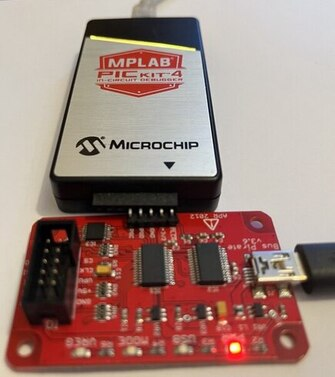
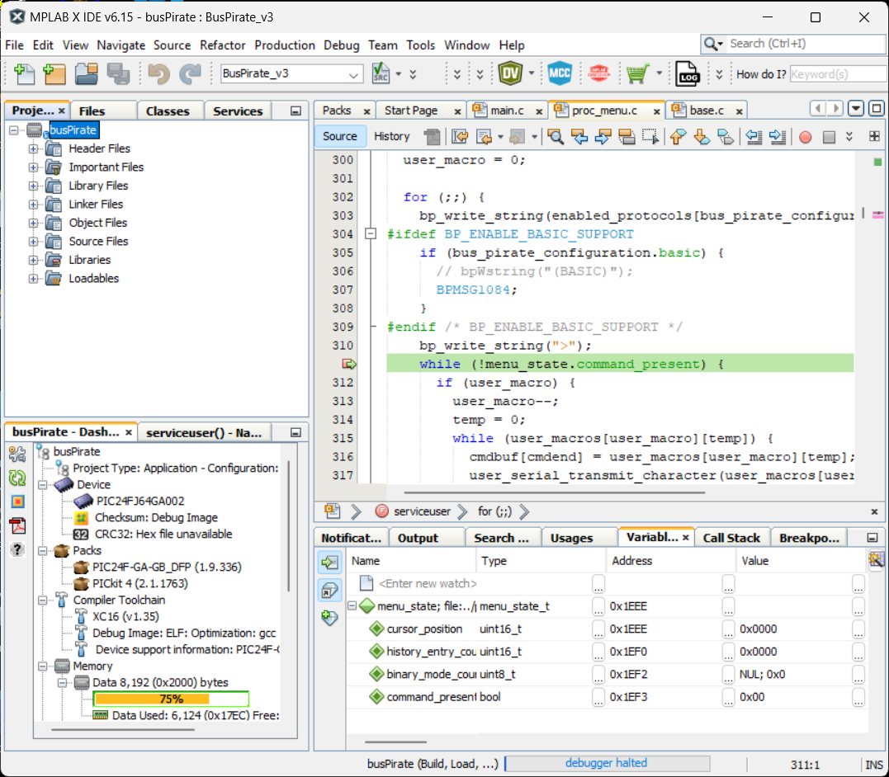

# buzzpirat


All-In-One Hardware Hacking tool for learning, practice, and play

Using the same hardware as **Bus Pirate v3** but with some enhancements:
- Fully compatible with both the official Bus Pirate firmware and bootloader, as well as versions supported by the Bus Pirate community
- Support for working directly with 5v, 3.3v, 2.5v and 1.8v. So you won't need an external circuit to hack a 1.8v SPI flash
- High-quality SMD IC hook clips and cables, designed to latch onto small chips, unlike the official offerings from Seeed Studio, Adafruit, or Sparkfun
- Enhanced power supply capabilities allow for the connection of more power-hungry devices
- Compatible with Bluetooth/WiFi UART adapters for both iOS and Android, allowing for chip hacking without the need for a PC
- All pins are duplicated to make the use of a logic analyzer easier, allowing you to hack a chip and capture your actions simultaneously
- The board features a designated Capture The Flag section, providing a hands-on opportunity for you to practice and hone your hacking skills on the included chips
- Designed for easy DIY repairs and modifications: Large components and ample spacing between them allow for hassle-free fixes. No need for a microscope or expensive tools - a soldering iron and a pair of tweezers are all you need
- Enhanced security with hardware protections such as overvoltage safeguards and measures to prevent damage to devices. However, please be mindful that there are always inherent risks with this type of tool
- One additional pin is available (total 4: TP0+PGD+PGC+AUX). So now it's possible to connect an auxiliary SPI device for debugging purposes or any other applications you might have in mind
- Area available to place a small protoboard for auxiliary circuits
- Pins soldered to facilitate programming of both the bootloader and chip, as well as enabling debugging of the device's firmware via MPLAB PICkit in-circuit debugger/programmer
- A battery can easily be connected
- External on/off functionality is also available
- Equipped with a USB Type-A male connector. If you lose the cable, you could connect it directly to the PC (although I don't recommend it, as the board is heavy)
- Striving to improve the user experience, making the documentation easier to understand for people who know nothing about electronics and maths
- Firmware improvements, creation of audiovisual content for education...
- Minimalist project, retaining only the essential things. The Bus Pirate repo, on the other hand, contains some stuff that I have no intention of maintaining

**WARNING**: Please be aware that buzzpirate is a **prototype** and not intended for mass production (limited stock available). As a small, artisanal creator without the extensive resources of a large company, I dedicate significant manual labor and attention to detail for each individual board. My commitment is to **quality** over quantity, and as a result, the product may be **priced higher**. Patience is appreciated as **human errors** and occasional **bugs** are an **inherent** part of this bespoke process. This product is neither a replacement for nor a competitor to the Bus Pirate; it's an entirely different approach. For a more **affordable**, **stable** option, consider purchasing a **Bus Pirate v3**

If you **value** what I am building and would like to see it thrive, please consider **making a donation** or purchasing one of the units. Your support will directly contribute to maintaining the project, acquiring necessary hardware, developing the website, enhancing mobile applications, and so much more

## Supported protocols
    
* 1-Wire
* UART
* I2C
* SPI
* JTAG
* MIDI
* PC keyboard
* HD44780 LCD
* 2- and 3-wire libraries with bitwise pin control
* Scriptable binary bitbang, 1-Wire, I2C, SPI, and UART modes.

## More features

* Python scripting support
* 0 - 5.5v tolerant pins
* 0 - 6v measurement probe
* 1Hz - 40MHz frequency measurement
* 1kHz - 4MHz pulse-width modulator, frequency generator
* On-board multi-voltage pull-up resistors
* On-board 1.8v, 2.5v, 3.3v and 5v power supplies with software reset
* Macros for common operations
* Bus traffic sniffers (SPI, I2C)
* A bootloader for easy firmware updates
* Transparent USB <--> serial mode
* 10Hz - 1MHz low-speed logic analyzer
* Servo driver
* Can program many AVR microcontrollers
  * Supported by AVRdude
* Public domain (Creative Commons Zero) source

## Application Support

* [AVRDude] AVR programmer (AVRDude v5.8+, firmware v4 (any) or v5.9+)
* [OpenOCD] JTAG debugger
* [flashrom] bios/flash programmer

## Recommended firmwares & bootloaders:

Modern:
- bin\BPv3-bootloader-upgrade-v4xtov4.5_Aug-2023_USBEprom.hex
- bin\BPv3-firmware-v7.1-JTAG_SAFE_1_Aug-2023_USBEprom.hex

Old & stable:
- bin\BPv3-Bootloader-v4.4.hex
- bin\BPv3-firmware-v6.3-r2151.hex

## Firmware Flashing

For windows:

- open the device manager on your computer
- connect the buzzpirat to your computer via a usb cable
- check for the new COM port assignment in the device manager (e.g., COM29)

```
cd bin
pirate-loader.exe --dev=COM29 --hex=BPv3-firmware-v6.3-r2151.hex
```

## How to compile bootloader & firmware

- MPLAB X IDE v6.15: https://www.microchip.com/en-us/tools-resources/develop/mplab-x-ide
- MPLAB XC16 Compiler: https://www.microchip.com/en-us/tools-resources/develop/mplab-xc-compilers

Just compile the following MPLAB projects:
- firmware\busPirate.X
- firmware\bootloader\ds30loader.X

To debug my own firmware I use a PICkit 5: https://www.microchip.com/en-us/development-tool/pg164150

How to Debug the Bus Pirate Firmware Using a Pickit 4:
- Connect Pickit via USB to PC
- Connect Bus pirate via USB to PC
- Connect Bus Pirate pins to the pins located furthest to the right of the Pickit:



Now you can use MPLAB IDE and MPLAB IPE



## Self-test guide

http://dangerousprototypes.com/docs/Bus_Pirate_self-test_guide

## Purchasing

TO-DO


